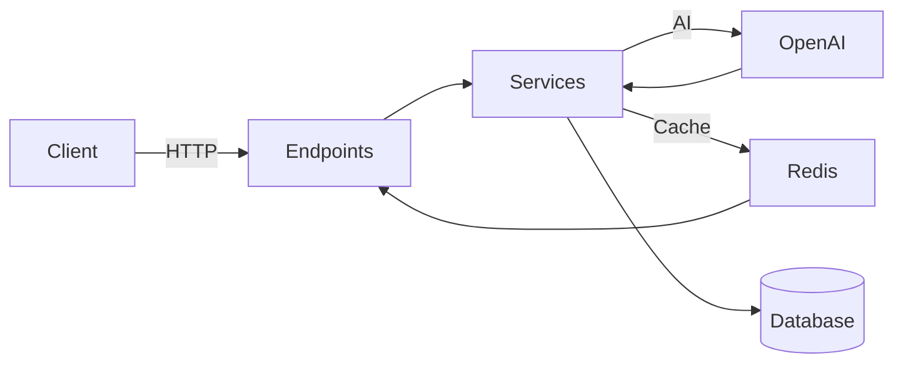

# Architecture Overview

Project: Pediatric Morning Report AI

## Clean Architecture Layers
- Controllers (FastAPI Endpoints): `backend/app/api/v1/endpoints/*.py`
- Services: `backend/app/services/*.py` (OpenAI, PubMed search helpers)
- Core: `backend/app/core/*` (config, security, cache)
- Repositories/Data Access: `backend/app/db/session.py`, `backend/app/models/*.py`
- Schemas: `backend/app/schemas/*.py` (Pydantic models)

## Data Flow
- Client → FastAPI Endpoint → Service Layer → External APIs (OpenAI) → DB Writes → Response
- Cache-aside: Endpoint queries Redis for cached analysis result; on miss, compute and set.

## External Integrations
- OpenAI: GPT-4o for analysis, Whisper for transcription
- Redis: Cache analysis results (`app/core/cache.py`)
- PubMed: Article search helper

## Security & Validation
- JWT Auth via `python-jose`, `passlib` (see `app/core/security.py`)
- Role-based access (`require_role` in `auth.py`)
- Input validation through Pydantic schemas

## Design Rationale
- FastAPI for speed and type-friendly APIs
- SQLAlchemy for ORM flexibility
- Redis to reduce LLM costs/latency via caching
- Dependency overrides to enable robust integration tests

## Scalability Considerations
- Move from SQLite to PostgreSQL for production
- Horizontal scaling behind a gateway; stateless app containers
- Rate limiting and request validation at API gateway
- Background workers for long-running analyses

## Diagram (Mermaid)

